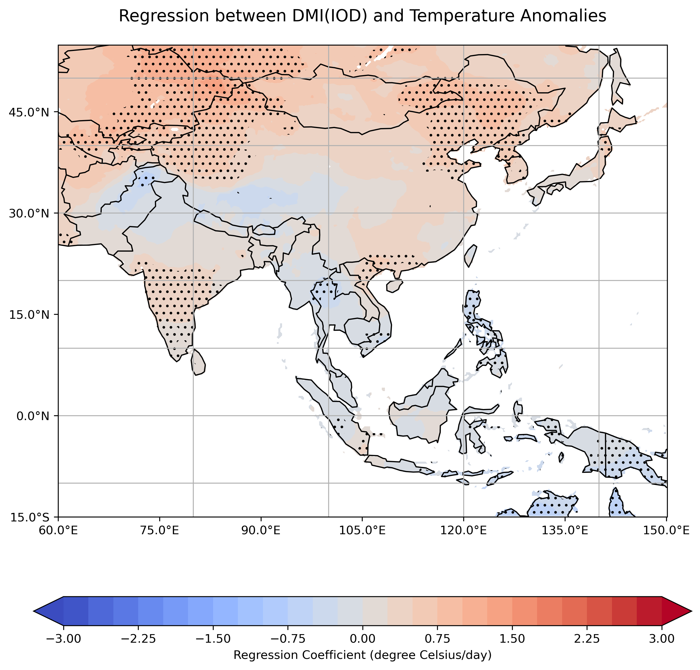
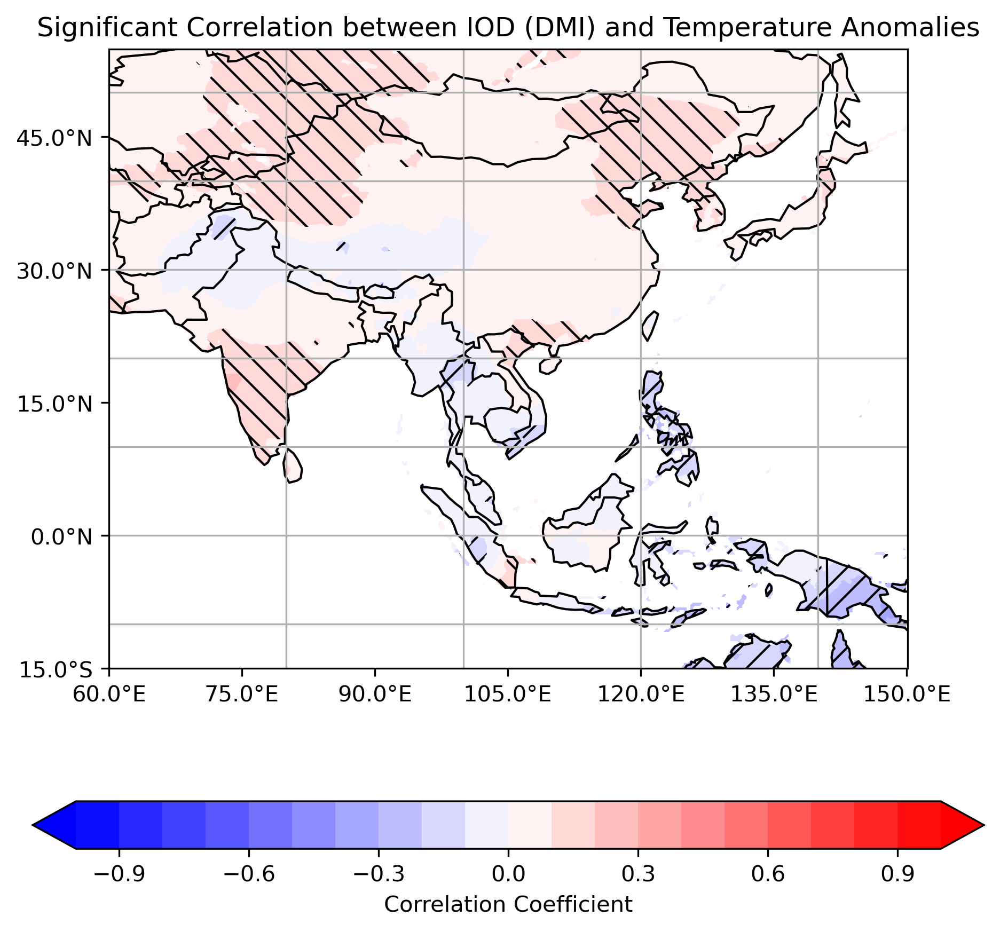
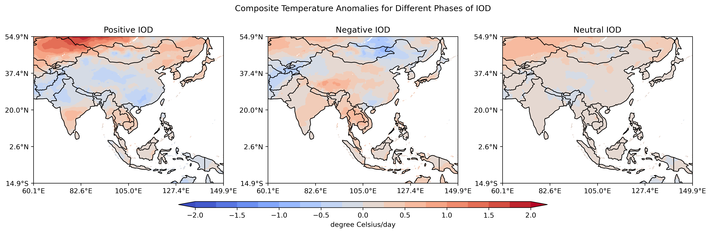

# The Effect of Indian Ocean Dipole 🌊 on Temperature ☀️ in Asia 
> [Github Page](https://shammun.github.io/clim_680_hw/)

**Shammunul Islam (sislam27@mason.edu)** 👋

## ✨ Intro 

  Due to climate variability and climate change, the world 🌎 is continuously affected by different extreme events, especially associated with high temperature. Asia is affected by many calamities caused by high temperature driven events. Indian Ocean 🌊 plays a critical role in the atmospheric dynamics of this region, particularly, Indian Ocean Dipole (IOD) 🌊, an oscillation of temperature in Indian Ocean equivalent to ENSO in central and eastern tropical Pacific Ocean. In this project, it is investigated whether there is any relationship between different phases of IOD 🌊, which areas have these relationships and whether these are statistically significant.

  For doing this study, APHRODITE Water Resources project data for daily mean temperature ☀️ is chosen as they have daily temperature data from 1962 upto 2015 in a gridded format with a high spatial resolution of 0.5 degree by 0.25 degree. For sea surface temperature, NOAA OISST V2 SST data is used as it has good spatial and temporal coverage.

  There are mainly 3 notebooks [HW1_New.ipynb](https://github.com/shammun/clim_680_hw/blob/main/HW1_New.ipynb), [HW2_New.ipynb](https://github.com/shammun/clim_680_hw/blob/main/HW2_New.ipynb), and [HW3_New.ipynb](https://github.com/shammun/clim_680_hw/blob/main/HW3_New.ipynb) that show you step by step process with Python code on how to analyze temperature and sea surface temperature data using XArray, Dask and many more!! This repository contains a collection of insightful Jupyter Notebooks and a dedicated GitHub Page built in requirement for the class project of 680: Climate Data, a course required for PhD in CLimate Dynamics, at George Mason Universityy.

  One caveat though 🙃, as the data size is huge, I couldn't `git push` these big files and so you will have to download the data by yourself in your local computer before you can run the code. Also when loading data, please modify the data source in the notebooks accordingly.

  Ohh, by the way, look at this Github page 📖 [https://shammun.github.io/clim_680_hw/](https://shammun.github.io/clim_680_hw/) associated with the repository that walks you through the codes and that also discusses the results. 

## 🌟 Key Features:

  * Interactive Notebooks
  * Detailed Analysis with Python Code 🐍
  * GitHub Page 📖 [Github Page](https://shammun.github.io/clim_680_hw/)

## Data 

### Temperature Data -- The APHRODITE Water Resources project

The APHRODITE Water Resources project is working on a series of precipitation products and this project completed its first phase in 2010 and embarked on its second phase in 2016, partnering with Hirosaki University, Kyoto University, and Chiba University. 

Daily mean temperature values are provided by their AphroTemp_V1808 at 0.50 and 0.25 degree grid resolutions. These readings are produced by extrapolating information from meteorological stations dispersed throughout the targeted area. After the release of AphroTemp_V1204R1, surface data from nations including India, Bhutan, Thailand, and Myanmar was included. The accuracy of the temperature readings in South Asia in the most recent version has been improved by this inclusion, along with updated interpolation methods and climatic data. For a better understanding of this dataset, you can refer to this [documentation](http://aphrodite.st.hirosaki-u.ac.jp/product/APHRO_V1808_TEMP/AphroTemp_V1808_readme.txt) 

#### The major characteristics of the dataset

- Spatial and Temporal Coverage

   * Spatial coverage      :  (MA) 60.0E - 150.0E, 15.0S - 55.0N
   * Spatial resolution    :  0.5 degree and 0.25 degree latitude/longitude
   * Temporal coverage     :  1961-2015
   * Temporal resolution   :  Daily

- Units
   * Daily mean temperature :  degC

- Missing Code

   * Daily mean temperature :  -99.9

### Sea Surface Temperature (SST) data -- NOAA OI SST V2 High Resolution Dataset

This gridded dataset NOAA OI SST V2 High Resolution Dataset can be found at [this link](https://psl.noaa.gov/data/gridded/data.noaa.oisst.v2.highres.html).

- Spatial and Temporal Coverage

   * Monthly values from 1981/12 to 2020/04
   * 1 degree latitude x 1 degree longitude global grid (360x180)
   * 89.5S - 89.5N, 0.5E to 359.5E

- Missing Data
   * Missing data is flagged with a value of -9.96921e+36f.

## 📊 Data Analysis 
  First of all temperature data was plotted for Asia. Temperature anomaly was also calculated for this region and     time series plot of surface temperature was also plotted. To understand the climatology, the climatological temperature for each month was also computed and plotted for Asia. Then, we worked on SST data by NOAA and computed Dipole Mode Index (DMI) to estimate Indian Ocean Dipole (IOD) from 1982 to 2020. Then composite analysis with DMI and temperature was performed to see how temperature responds to different phases (positive, negative and neutral phases) of IOD. Temporal correlation coefficient analysis was also performed which showed some areas in Asia have strong correlation with IOD. Further, it was also investigated whether the change in temperature can be explained by IOD by setting up a linear regression by regressing temperature on IOD. It was found that for some areas it does have statistically significant regression parameter values.

## Results

  This project gives us some insights into the dynamics between the Indian Ocean Dipole (IOD) and temperature variations across Asia. Here are the key findings:

  **Temporal Temperature Variations**: We observed temperature changes over time from 1961 and 2015. This was evident from the temperature anomaly plots and time series plots, indicating a shift in temperature patterns over the decades.

  **Seasonal Analysis**: Focusing on the June to September period (JJAS), a crucial season for Asian climate, we saw an increasing trend in temperature evolution from 1961 to 2015 as found in the line chart.

  **IOD's Influence on Regional Temperatures**: This project work investigated how different IOD phases - positive, negative, and neutral - impact regional temperatures. The results from composite maps and statistical tests (like t-tests) underscored the significant influence of IOD on temperature anomalies in specific Asian regions.

  **Correlation and Regression Analyses**: We conducted correlation and regression analyses to quantify the relationship between IOD and temperature anomalies. The findings indicated strong correlations in certain areas, affirming the impact of IOD on regional climatic conditions. This was further reinforced by regression analyses, revealing the extent to which temperature variations could be attributed to changes in IOD. Northeast and Northwest of China, south of India, Kazakhstan, Uzbekistan, and east of Mongolia respond positively, while the Philipines, north-west part of Thailand, northern part of Vietnam, and Papua New Guinea respond negatively to IOD change or signal.

## 🚀 Getting Started or Setting Up this Repo in Your Computer
  These instructions will get you a copy of the project up and running on your local machine to be able to run the notebooks.

## 🧰 Prerequisites
  What things you need to install the software and how to install them:

* [Anaconda](https://www.anaconda.com/products/individual) or [Miniconda](https://docs.conda.io/en/latest/miniconda.html)
* [Git](https://git-scm.com/downloads)

## ⚙️ Installation or Working with the Code
  A step-by-step series of examples that tell you how to get a development environment running:

  1. 💾 Clone the Repository: 

    `git clone https://github.com/shammun/clim_680_hw`

  2. 🧭 Navigate to the Repository:

    `cd clim_680_hw`

  3. 🌱 Create the Conda Environment:

    `conda env create -f environment.yml`

  4. 🔧 Activate the Environment:

    `conda activate [Your Environment Name]`

  5. 📓 Launch Jupyter Notebook:

    `jupyter notebook`

  6. View 👀 GitHub 🐙 Page 📄:

     Visit [https://shammun.github.io/clim_680_hw/] to explore the GitHub Page associated with this project.

  ## 📚 Documentation
  For more detailed information about this class project, refer to the following resources:

 **Notebooks**: Each notebook contains details on what to do and how to do. [Notebook1](https://github.com/shammun/clim_680_hw/blob/main/HW1_New.ipynb), [Notebook2](https://github.com/shammun/clim_680_hw/blob/main/HW2_New.ipynb), [Notebook3](https://github.com/shammun/clim_680_hw/blob/main/HW3_New.ipynb)
 
 **GitHub Page**: For a more interactive experience and ready-made visualization. [Github Page](https://shammun.github.io/clim_680_hw/)

## 📩 Contact
  Shammunul Islam - [sha_is13@yahoo.com, shais13irs@gmail.com, si2267@gmu.edu]

  Project Link: [https://shammun.github.io/clim_680_hw/]

## Screenshots

