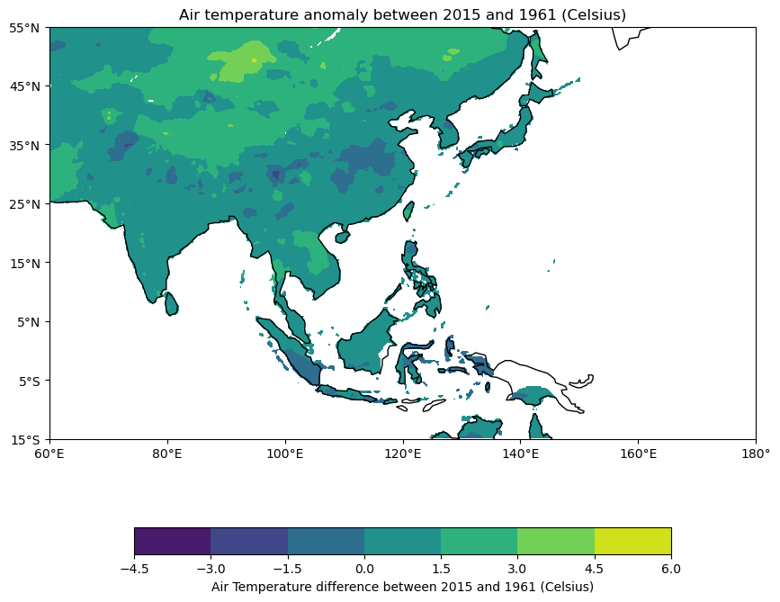

# Homework for CLIM 680: Climate Data
**Shammunul Islam (sislam27@mason.edu)**

## Temperature ☀️ analysis of South-Asia using APHRODITE Water Resources project's data


## Introduction

I tried to visually explore temperature data of South Asia data provided by [APHRODITE Water Resources project](https://www.chikyu.ac.jp/precip/english/downloads.html?fbclid=IwAR1P-1G9nxc8SQV0WfF2cA7mnGvRjI5RDB3RfEhpNuGBh2-im35TPNzDVAM). Using Python along with XArray, Cartopy, matplotlib I visualized maps of temperature. A comparison of temperature between 1961 and 2015 is also made. I also made an attempt to understand how June, July, August, September (JJAS) temperature changed over time by making an animation map where at each step of the animation, average temperature of JJAS is plotted.

This repository will be continuously updated as the course will go on.

## Table of Contents

- [Introduction](#introduction)
- [Installation](#installation)
- [Usage](#usage)
- [Screenshots](#screenshots)
- [Contributing](#contributing)
- [License](#license)
- [Acknowledgements](#acknowledgements)

## Installation

First, create an new directory, say, HW_680 in the Google Drive. Now, download all the files from [here](https://drive.google.com/drive/folders/1EukZxXlbvCAKh_HapVIGaFWNbEYb4xP8?usp=sharing) and upload it to the newly created folder HW_680 created in your Google Drive. 

After the upload is computed, open the notebook **680_hw_colab2.ipynb** in Google Colab.

After running the below two lines:

```
from google.colab import drive
drive.mount('/content/drive')
```

change the below path according to the path of the folder in your Google Drive.

```
path = '/content/drive/MyDrive/HW_680/'
```

The below is supposed to work if I was able to upload all data to Github. But, as for some unknown reasons, I couldn't push all the files to Github repository. I will hopefully be able to push all the files later and then the below instruction will be helpful.

1. Clone the repository:

   ```
   git clone https://github.com/shammun/clim_680_hw
   ```

2. Navigate to the project directory:

   ```
   cd clim_680_hw
   ```

3. Create a virtual environment

   ```
   conda create --name clim680_hw python=3.11
   ```

4. Activate the environment:

   ```
   conda activate clim680_hw
   ```


3. Install the required packages:

   ```
   pip install -r requirements.txt
   ```

## Usage

To run the Jupyter notebook, in the terminal, type

```
jupyter notebook
```

This will start the Jupyter notebook from where select and open **680_hw.ipynb**. Now, the code can be run from inside this notebook.

## Screenshots





