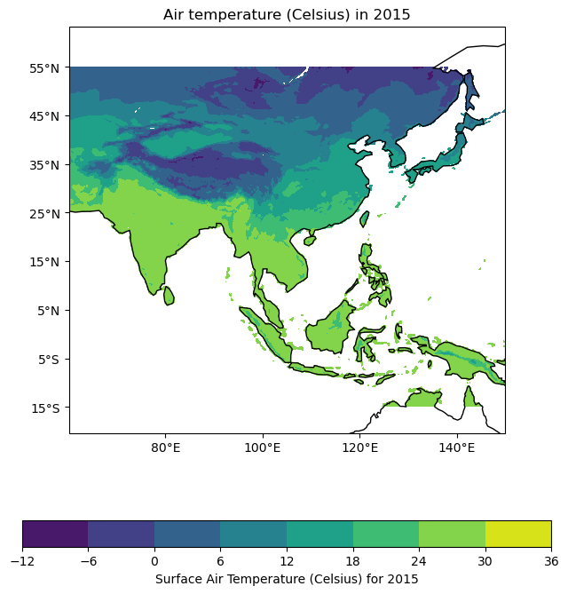

# Impact of Indian Ocean Dipole on Temperature in Asia 

### Introduction 
The key science topic you are interested in exploring with your dataset. Describe your scientific topic and why you chose this dataset.  

### Data 
A description of your primary dataset and any additional datasets used (e.g. climate indices, comparison datasets).  Should include links or paths to where the datasets are located and some information about the data original source. Should also include any unique information about your data relevant to this class (e.g. data is on an irregular grid) 

### Code description 
Description of each of your analyses along with a link to your notebook for each analysis. This can be in a bullet or table of contents type format.  

<!-- Image -->

<!-- Code Block (initially hidden) -->
<pre id="code1" style="display:none;" onclick="toggleVisibility('image1', 'code1')">
  <code>
    // Your code here
    import matplotlib.pyplot as plt
import cartopy.crs as ccrs
import numpy as np
from cartopy.util import add_cyclic_point
import cartopy.mpl.ticker as cticker
import cartopy.feature as cfeature

# Assuming ds_mean_1961 and ds_1961 are your data sources

# Make the figure larger
fig = plt.figure(figsize=(11, 8.5))

# Set the axes using the specified map projection
# Adjust the position of the map to leave space for the colorbar
ax = plt.axes([0.05, 0.2, 0.9, 0.7], projection=ccrs.PlateCarree())

# Add cyclic point to data
data = ds_mean_1961['tave']
data, lons = add_cyclic_point(data, coord=ds_1961['lon'])

# Define levels for finer intervals, ignoring NaNs
level_interval = 2  # Change this value as needed
levels = np.arange(np.nanmin(data), np.nanmax(data) + level_interval, level_interval)

# Make a filled contour plot with specified levels
cs = ax.contourf(lons, ds_1961['lat'], data, levels=levels,
                 transform=ccrs.PlateCarree(), cmap='coolwarm', extend='both')

# Add coastlines
ax.coastlines()
# Add country boundaries
ax.add_feature(cfeature.BORDERS, edgecolor='black')

# Define the xticks for longitude
lon_range = np.arange(np.floor(ds_1961['lon'].min()), np.ceil(ds_1961['lon'].max()) + 1, 20)
ax.set_xticks(lon_range, crs=ccrs.PlateCarree())
lon_formatter = cticker.LongitudeFormatter()
ax.xaxis.set_major_formatter(lon_formatter)

# Define the yticks for latitude
lat_range = np.arange(np.floor(ds_1961['lat'].min()), np.ceil(ds_1961['lat'].max()) + 1, 10)
ax.set_yticks(lat_range, crs=ccrs.PlateCarree())
lat_formatter = cticker.LatitudeFormatter()
ax.yaxis.set_major_formatter(lat_formatter) 

# Define the longitude and latitude range
ax.set_extent([ds_1961['lon'].min(), ds_1961['lon'].max(), ds_1961['lat'].min(), ds_1961['lat'].max()])

# Add title
plt.title("Air Temperature (Celsius) in 1961")

# Create a new axes for the colorbar just below the map
cbar_ax = fig.add_axes([0.15, 0.1, 0.7, 0.03]) # Adjust these values as needed
cbar = plt.colorbar(cs, cax=cbar_ax, orientation='horizontal', label='Surface Air Temperature (Celsius)')

# Save and show the plot
plt.savefig('air_temp_1961.png', dpi=300, bbox_inches='tight')
plt.show()
  </code>
</pre>

### Results 
What does your analysis show that is scientifically interesting? What have you discovered?  

### Summary 
Provide short summary of what you learned from your analysis of your data (both scientific and technical), what you would do next to advance this analysis, and any challenges or issues you encountered/overcame.

