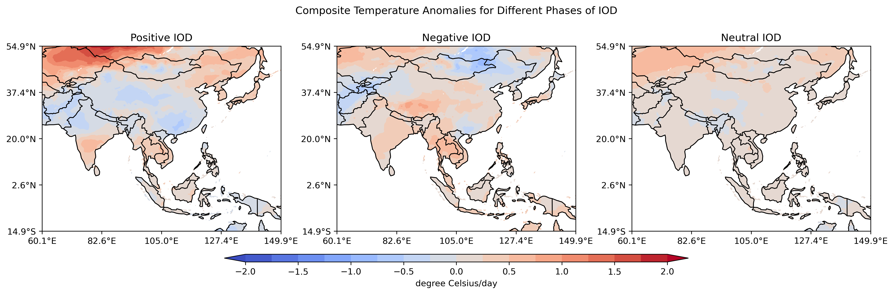
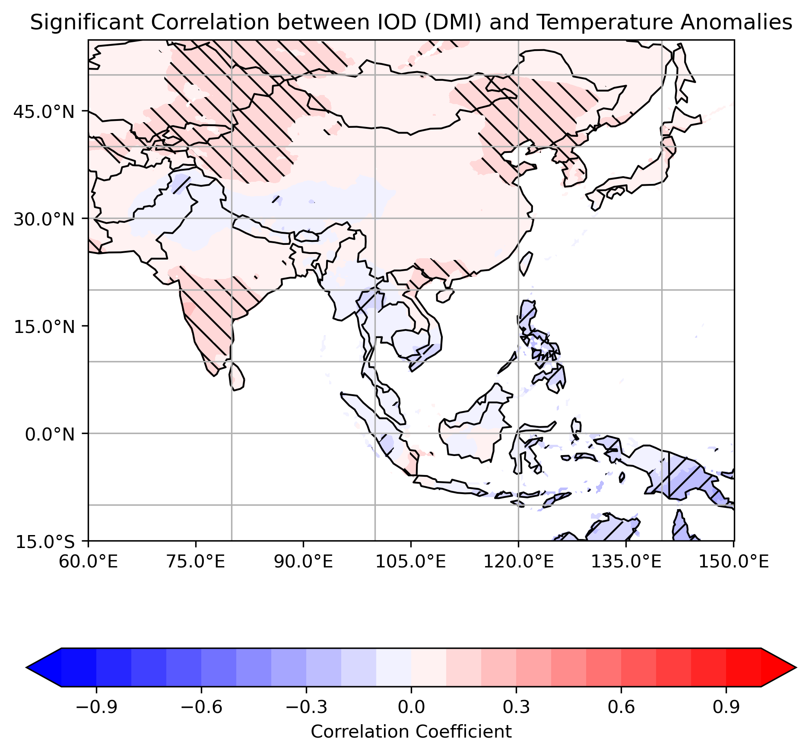

# The Relationship between Indian Ocean Dipole (IOD) 🌊 and Temperature ☀️ in Asia
> **Author**: Shammunul Islam \
> **Course**: Climate Data (CLIM680) (Fall 2023), Department of Atmospheric, Oceanic & Earth Sciences, George Mason University \
> **Contact**: [sislam27@gmu.edu](mailto:sislam27@gmu.edu)

### Introduction 

Due to climate variability and climate change, the world is continuously affected by different extreme events, especially associated with high temperature. Asia is affected by many calamities caused by high temperature driven events. Indian Ocean plays a critical role in the atmospheric dynamics of this region, particularly, Indian Ocean Dipole (IOD), an oscillation of temperature in Indian Ocean equivalent to ENSO in central and eastern tropical Pacific Ocean. In this project, it is investigated whether there is any relationship between different phases of IOD and temperature, if there is, which areas have these relationships, and whether these are statistically significant. Along with this, it was also investigated how the temperature in Aisa reponds to different phases of IOD.

For doing this study, APHRODITE Water Resources project data for daily mean temperature is chosen as they have daily temperature data from 1962 upto 2015 in a gridded format with a high spatial resolution of 0.5 degree by 0.25 degree. For sea surface temperature, NOAA OISST V2 SST data is used as it has 1 degree by 1 degree spatial resolution and temporal coverage starting from the end of 1981..

### Data 

#### Temperature Data -- The APHRODITE Water Resources project

The APHRODITE Water Resources project is working on a series of precipitation products and this project completed its first phase in 2010 and embarked on its second phase in 2016, partnering with Hirosaki University, Kyoto University, and Chiba University. 

Daily mean temperature values are provided by their AphroTemp_V1808 at 0.50 and 0.25 degree grid resolutions. These readings are produced by extrapolating information from meteorological stations dispersed throughout the targeted area. After the release of AphroTemp_V1204R1, surface data from nations including India, Bhutan, Thailand, and Myanmar was included. The accuracy of the temperature readings in South Asia in the most recent version has been improved by this inclusion, along with updated interpolation methods and climatic data. For a better understanding of this dataset, you can refer to this [documentation](http://aphrodite.st.hirosaki-u.ac.jp/product/APHRO_V1808_TEMP/AphroTemp_V1808_readme.txt) 

##### The major characteristics of the dataset

- Spatial and Temporal Coverage

   * Spatial coverage      :  (MA) 60.0E - 150.0E, 15.0S - 55.0N
   * Spatial resolution    :  0.5 degree and 0.25 degree latitude/longitude
   * Temporal coverage     :  1961-2015
   * Temporal resolution   :  Daily

- Units
   * Daily mean temperature :  degree Celsius (degC)

- Missing Code

   * Daily mean temperature :  -99.9

##### NOAA OI SST V2 High Resolution Dataset

This gridded dataset NOAA OI SST V2 High Resolution Dataset can be found at [this link](http://www.emc.ncep.noaa.gov/research/cmb/sst_analysis/). I used monthly mean of sea surface temperature dataset hosted in Hopper.  

- Spatial and Temporal Coverage

   * Monthly values from 1981/12 to 2020/04
   * 1 degree latitude x 1 degree longitude global grid (360x180)
   * 89.5S - 89.5N, 0.5E to 359.5E

- Units
   * Daily mean temperature :  degree Celsius (degC)
     
- Missing Code
   * Missing data code: -9.96921e+36f.

### Code description or data analysis

#### Temperature analysis
First of all, air temperature (in Celsius) is plotted over Asia using different Python libraries, including Cartopy and Matplotlib. Detailed step-by-step methods with code can be found in this [notebook1](https://github.com/shammun/clim_680_hw/blob/main/HW1_New.ipynb). But, the code for each of the figures displayed here can also be seen by clicking on the button placed above each figure. 

<!-- Toggle Button -->
<button onclick="toggleVisibility('image1', 'code1')" style="background-color: #0066cc; color: white; border: none; padding: 10px 20px; text-align: center; text-decoration: none; display: inline-block; font-size: 16px; margin: 4px 2px; cursor: pointer; border-radius: 8px;">
    Toggle between image and code
</button>
<!-- Image -->

<!-- Code Block (initially hidden) -->
<pre id="code1" style="display:none; background-color: #f7f7f7; border-left: 5px solid #0066cc; padding: 10px; margin: 10px 0; overflow: auto; font-family: 'Courier New', Courier, monospace; font-size: 14px; line-height: 1.6;">
  <code>
import matplotlib.pyplot as plt
import cartopy.crs as ccrs
import numpy as np
from cartopy.util import add_cyclic_point
import cartopy.mpl.ticker as cticker
import cartopy.feature as cfeature

# Make the figure larger
fig = plt.figure(figsize=(11, 8.5))

# Set the axes using the specified map projection
# Adjust the position of the map to leave space for the colorbar
ax = plt.axes([0.05, 0.2, 0.9, 0.7], projection=ccrs.PlateCarree())

# Add cyclic point to data
data = ds_mean_1961['tave']
data, lons = add_cyclic_point(data, coord=ds_1961['lon'])

# Define levels for finer intervals, ignoring NaNs
level_interval = 2 
levels = np.arange(np.nanmin(data), np.nanmax(data) + level_interval, level_interval)

# Make a filled contour plot with specified levels
cs = ax.contourf(lons, ds_1961['lat'], data, levels=levels,
                 transform=ccrs.PlateCarree(), cmap='coolwarm', extend='both')

# Add coastlines
ax.coastlines()
# Add country boundaries
ax.add_feature(cfeature.BORDERS, edgecolor='black')

# Define the xticks for longitude
lon_range = np.arange(np.floor(ds_1961['lon'].min()), np.ceil(ds_1961['lon'].max()) + 1, 20)
ax.set_xticks(lon_range, crs=ccrs.PlateCarree())
lon_formatter = cticker.LongitudeFormatter()
ax.xaxis.set_major_formatter(lon_formatter)

# Define the yticks for latitude
lat_range = np.arange(np.floor(ds_1961['lat'].min()), np.ceil(ds_1961['lat'].max()) + 1, 10)
ax.set_yticks(lat_range, crs=ccrs.PlateCarree())
lat_formatter = cticker.LatitudeFormatter()
ax.yaxis.set_major_formatter(lat_formatter) 

# Define the longitude and latitude range
ax.set_extent([ds_1961['lon'].min(), ds_1961['lon'].max(), ds_1961['lat'].min(), ds_1961['lat'].max()])

# Add title
plt.title("Air Temperature (Celsius) in 1961")

# Create a new axes for the colorbar just below the map
cbar_ax = fig.add_axes([0.15, 0.1, 0.7, 0.03])
cbar = plt.colorbar(cs, cax=cbar_ax, orientation='horizontal', label='Surface Air Temperature (Celsius)')

# Save and show the plot
plt.savefig('air_temp_1961.png', dpi=300, bbox_inches='tight')
plt.show()
  </code>
</pre>

Now, let's see if the temperature changed in 2015 compared to 1961 by plotting the temperature anomaly [notebook1](https://github.com/shammun/clim_680_hw/blob/main/HW1_New.ipynb).

<button onclick="toggleVisibility('image2', 'code2')" style="background-color: #0066cc; color: white; border: none; padding: 10px 20px; text-align: center; text-decoration: none; display: inline-block; font-size: 16px; margin: 4px 2px; cursor: pointer; border-radius: 8px;">
    Toggle between image and code
</button>
<!-- Image -->

<pre id="code2" style="display:none; background-color: #f7f7f7; border-left: 5px solid #0066cc; padding: 10px; margin: 10px 0; overflow: auto; font-family: 'Courier New', Courier, monospace; font-size: 14px; line-height: 1.6;">
  <code>
import matplotlib.pyplot as plt
import cartopy.crs as ccrs
import numpy as np
from cartopy.util import add_cyclic_point
import cartopy.mpl.ticker as cticker
import cartopy.feature as cfeature

fname = 'APHRO_MA_TAVE_025deg_V1808.2015.nc.nc'
ds_2015 = xr.open_dataset(fname)
ds_mean_2015=ds_2015.mean(dim='time')
fname = 'APHRO_MA_TAVE_025deg_V1808.1961.nc.nc'
ds_1961 = xr.open_dataset(fname)
ds_mean_1961=ds_1961.mean(dim='time')
anomaly = ds_mean_2015 - ds_mean_1961

# Make the figure larger
fig = plt.figure(figsize=(11, 8.5))

# Set the axes using the specified map projection
ax = plt.axes(projection=ccrs.PlateCarree(), position=[0.05, 0.15, 0.9, 0.7])  # Adjust the position of the map

# Add cyclic point to data
data = anomaly['tave']
data, lons = add_cyclic_point(data, coord=ds_2015['lon'])

# Define levels for finer intervals, considering a more detailed range
min_val = np.nanmin(data)
max_val = np.nanmax(data)
level_interval = 0.5  # Smaller interval for more granularity
levels = np.arange(min_val, max_val + level_interval, level_interval)

# Make a filled contour plot with specified levels
cs = ax.contourf(lons, ds_2015['lat'], data, levels=levels,
                 transform=ccrs.PlateCarree(), cmap='coolwarm', extend='both')

# Add coastlines
ax.coastlines()
# Country boundaries
ax.add_feature(cfeature.BORDERS, edgecolor='black')

# Define the xticks for longitude
lon_range = np.arange(np.floor(ds_2015['lon'].min()), np.ceil(ds_2015['lon'].max()) + 1, 20)
ax.set_xticks(lon_range, crs=ccrs.PlateCarree())
lon_formatter = cticker.LongitudeFormatter()
ax.xaxis.set_major_formatter(lon_formatter)

# Define the yticks for latitude
lat_range = np.arange(np.floor(ds_2015['lat'].min()), np.ceil(ds_2015['lat'].max()) + 1, 10)
ax.set_yticks(lat_range, crs=ccrs.PlateCarree())
lat_formatter = cticker.LatitudeFormatter()
ax.yaxis.set_major_formatter(lat_formatter) 

# Define the longitude and latitude range
ax.set_extent([ds_2015['lon'].min(), ds_2015['lon'].max(), ds_2015['lat'].min(), ds_2015['lat'].max()])

# Add title with adjusted position
plt.title("Air temperature anomaly between 2015 and 1961 (Celsius)", pad=20)

# Reposition the colorbar to increase the gap from the map
cbar_ax = fig.add_axes([0.15, 0.07, 0.7, 0.03])  # Adjusted to increase the gap
cbar = plt.colorbar(cs, cax=cbar_ax, orientation='horizontal', label='Air Temperature difference (Celsius)')

plt.savefig('air_temp_anomaly_2015_1961.png', dpi=300, bbox_inches='tight')
plt.show()
  </code>
</pre>

##### June, July, August, September (JJAS) temperature

This is normally the summer season and here, I have investigated whether temperature increased in Asia in this season. Let's look at the temperature evolution over the period from 1961 to 2015 [notebook1](https://github.com/shammun/clim_680_hw/blob/main/HW1_New.ipynb).

<button onclick="toggleVisibility('image3', 'code3')" style="background-color: #0066cc; color: white; border: none; padding: 10px 20px; text-align: center; text-decoration: none; display: inline-block; font-size: 16px; margin: 4px 2px; cursor: pointer; border-radius: 8px;">
    Toggle between image and code
</button>
<!-- Image -->

<pre id="code3" style="display:none; background-color: #f7f7f7; border-left: 5px solid #0066cc; padding: 10px; margin: 10px 0; overflow: auto; font-family: 'Courier New', Courier, monospace; font-size: 14px; line-height: 1.6;">
  <code>
import xarray as xr
import matplotlib.pyplot as plt
import pandas as pd
import seaborn as sns

# Set the style for the plot
plt.style.use('seaborn-whitegrid')
sns.set_context('talk')

# Select the temperature variable (tave)
tave = ds['tave']

# Filter the dataset to include only JJAS (months 6, 7, 8, and 9)
tave_jjas = tave.sel(time=tave['time'].dt.month.isin([6, 7, 8, 9]))

# Calculate the mean for each JJAS across latitude and longitude dimensions
jjas_mean = tave_jjas.mean(dim=['lat', 'lon'])

# Group by year and then calculate the mean for each year
yearly_avg = jjas_mean.groupby('time.year').mean()

# Convert to a pandas DataFrame for plotting
yearly_avg_df = yearly_avg.to_dataframe().reset_index()

# Plotting
plt.figure(figsize=(15, 8))

plt.plot(yearly_avg_df['year'], yearly_avg_df['tave'], marker='o', linestyle='-', color='royalblue')

plt.xlabel('Year')
plt.ylabel('Average Temperature (JJAS)')
plt.title('Average Temperature for JJAS Over Years in Asia')

# Adding a grid for better readability
plt.grid(True, which='both', linestyle='--', linewidth=0.5)

# Enhance aesthetics
plt.xticks(rotation=45)
plt.tight_layout()

# Adding minor ticks
plt.minorticks_on()

# Adding custom text
credit_text = "Prepared by:\nShammunul Islam\nData Source: APHRODITE Daily Mean Temperature Dataset"
plt.text(0.65, 0.05, credit_text, transform=plt.gca().transAxes, fontsize=10, 
         verticalalignment='bottom', horizontalalignment='left', 
         bbox=dict(facecolor='white', alpha=0.5))

# Adjust the padding of the plot, if necessary
plt.subplots_adjust(bottom=0.15, right=0.85)

# Save and show the plot
plt.savefig('average_temp_JJAS_over_years.png', dpi=300, bbox_inches='tight')
plt.show()
  </code>
</pre>

Now, let's have a look at JJAS temperature anomaly over this period [notebook1](https://github.com/shammun/clim_680_hw/blob/main/HW1_New.ipynb).

<button onclick="toggleVisibility('image4', 'code4')" style="background-color: #0066cc; color: white; border: none; padding: 10px 20px; text-align: center; text-decoration: none; display: inline-block; font-size: 16px; margin: 4px 2px; cursor: pointer; border-radius: 8px;">
    Toggle between image and code
</button>
<!-- Image -->

<pre id="code4" style="display:none; background-color: #f7f7f7; border-left: 5px solid #0066cc; padding: 10px; margin: 10px 0; overflow: auto; font-family: 'Courier New', Courier, monospace; font-size: 14px; line-height: 1.6;">
  <code>
import numpy as np
import xarray as xr
import matplotlib.pyplot as plt
import matplotlib.animation as animation
import cartopy.crs as ccrs
import cartopy.feature as cfeature
import cartopy.mpl.ticker as cticker

def load_dataset(year):
    filename = f"APHRO_MA_TAVE_025deg_V1808.{year}.nc.nc"
    ds = xr.open_dataset(filename)
    return ds

def calculate_jjas_anomaly(year, long_term_mean):
    jjas_data = load_dataset(year)['tave'].sel(time=load_dataset(year)['time.month'].isin([6, 7, 8, 9])).mean(dim='time')
    anomaly = jjas_data - long_term_mean
    return anomaly

def plot_data(data, ax):
    lons, lats = np.meshgrid(data['lon'], data['lat'])
    # Adjust the level_interval for finer gradations
    level_interval = 0.2  # Smaller interval for more detailed color gradations
    levels = np.linspace(data.min(), data.max(), num=int((data.max() - data.min()) / level_interval))
    cs = ax.contourf(lons, lats, data, levels=levels, transform=ccrs.PlateCarree(), cmap='coolwarm', extend='both')
    return cs

# Compute the long-term JJAS mean (1961-2015)
long_term_mean = xr.concat([load_dataset(year)['tave'].sel(time=load_dataset(year)['time.month'].isin([6, 7, 8, 9])) for year in range(1961, 2016)], dim='time').mean(dim='time')

# Create the initial figure and axis with adjusted vertical size
fig, ax = plt.subplots(figsize=(11, 10), subplot_kw={'projection': ccrs.PlateCarree()})
ax.coastlines()
ax.add_feature(cfeature.BORDERS, linestyle=':')

# Load the first year's data to initialize the colorbar
initial_data = calculate_jjas_anomaly(1961, long_term_mean)
cs = plot_data(initial_data, ax)

# Adjust the colorbar to align with the map's extent
cbar_ax = fig.add_axes([0.125, 0.08, 0.775, 0.03])  # Slightly raise the colorbar
cbar = fig.colorbar(cs, cax=cbar_ax, orientation='horizontal', label='Temperature Anomaly (Celsius)')

def update_plot(year):
    ax.clear()
    ax.coastlines()
    ax.add_feature(cfeature.BORDERS, linestyle=':')
    data = calculate_jjas_anomaly(year, long_term_mean)
    cs = plot_data(data, ax)
    ax.set_title(f"JJAS Temperature Anomaly for {year}", fontsize=14, pad=20)
    
    # Set dynamic longitude and latitude labels based on the data
    lon_range = np.arange(np.floor(data['lon'].min()), np.ceil(data['lon'].max()) + 1, 10)
    lat_range = np.arange(np.floor(data['lat'].min()), np.ceil(data['lat'].max()) + 1, 10)
    ax.set_xticks(lon_range, crs=ccrs.PlateCarree())
    ax.set_yticks(lat_range, crs=ccrs.PlateCarree())
    ax.xaxis.set_major_formatter(cticker.LongitudeFormatter())
    ax.yaxis.set_major_formatter(cticker.LatitudeFormatter())

    return cs

# Create the animation
years = range(1961, 2016)
ani = animation.FuncAnimation(fig, update_plot, frames=years, repeat=True, blit=False)

# Save the animation as a .gif
ani.save('jjas_temperature_anomaly.gif', writer='imagemagick', fps=1.8)

plt.show()
  </code>
</pre>

We see that it changed over time but it is not clear whether it has a consistent increase or decrease or no change.

Now, let's have a look at standard deviation of temperature over Asia to see how it varies in different areas of Asia [notebook1](https://github.com/shammun/clim_680_hw/blob/main/HW1_New.ipynb).

<!-- Toggle Button for Image 5 -->
<button onclick="toggleVisibility('image5', 'code5')" style="background-color: #0066cc; color: white; border: none; padding: 10px 20px; text-align: center; text-decoration: none; display: inline-block; font-size: 16px; margin: 4px 2px; cursor: pointer; border-radius: 8px;">
    Toggle between image and code
</button>

<!-- Image 5 -->

<!-- Code Block for Image 1 (initially hidden) -->
<pre id="code5" style="display:none; background-color: #f7f7f7; border-left: 5px solid #0066cc; padding: 10px; margin: 10px 0; overflow: auto; font-family: 'Courier New', Courier, monospace; font-size: 14px; line-height: 1.6;">
  <code>
import xarray as xr
import matplotlib.pyplot as plt
import cartopy.crs as ccrs
import cartopy.feature as cfeature
import numpy as np

# Open the dataset
ds = xr.open_mfdataset('APHRO_MA_TAVE_025deg_V1808.*.nc')

# Filter the dataset to include only June, July, August, and September
ds_jjas = ds['tave'].sel(time=ds['tave']['time'].dt.month.isin([6, 7, 8, 9]))

# Calculate the standard deviation of 'tave' for JJA across the time dimension
tave_std_jjas = ds_jjas.std(dim='time')

# Compute the standard deviation
tave_std_jjas = tave_std_jjas.compute()

# Define the figure and axis
fig, ax = plt.subplots(figsize=(11, 8.5), subplot_kw={'projection': ccrs.PlateCarree()})
fig.subplots_adjust(bottom=0.2, top=0.9, left=0.05, right=0.95, wspace=0.1, hspace=0.5)

# Dynamically define levels based on the data
min_val = tave_std_jjas.min()
max_val = tave_std_jjas.max()
levels = np.linspace(min_val, max_val, 20)  # Adjust 20 to the desired number of steps

# Make a filled contour plot
cs = ax.contourf(tave_std_jjas['lon'], tave_std_jjas['lat'], tave_std_jjas, 
                 levels=levels, transform=ccrs.PlateCarree(), 
                 cmap='YlOrRd', extend='both')

# Add coastlines and borders
ax.coastlines()
ax.add_feature(cfeature.BORDERS, edgecolor='black')

# Add gridlines and format them
def format_lon(value, tick_number):
    return f"{value:.1f}°E" if value >= 0 else f"{abs(value):.1f}°W"

def format_lat(value, tick_number):
    return f"{value:.1f}°N" if value >= 0 else f"{abs(value):.1f}°S"

ax.gridlines()
ax.set_xticks(np.arange(np.floor(min(ds_jjas['lon'])), np.ceil(max(ds_jjas['lon'])), 15), crs=ccrs.PlateCarree())
ax.set_yticks(np.arange(np.floor(min(ds_jjas['lat'])), np.ceil(max(ds_jjas['lat'])), 15), crs=ccrs.PlateCarree())
ax.xaxis.set_major_formatter(plt.FuncFormatter(format_lon))
ax.yaxis.set_major_formatter(plt.FuncFormatter(format_lat))

# Add colorbar with increased size
cbar_ax = fig.add_axes([0.15, 0.1, 0.7, 0.04])  # Adjusted y position of colorbar
cbar = plt.colorbar(cs, cax=cbar_ax, orientation='horizontal', label='Standard Deviation (degree Celsius)')
cbar.ax.tick_params(labelsize=10)

# Add title to the map
ax.set_title('Standard Deviation of Temperature for JJAS', fontsize=14, pad=20)

# Save and show the plot
plt.savefig('std_dev_temp_JJAS.png', dpi=300, bbox_inches='tight')
plt.show()
  </code>
</pre>

We can see that standard deviation of temperature varies over Asia. Although it seems that the standard deviation increases as we south.

#### Climatology of temperature in Asia

Now, let's have a look at the climatology of temperature in Asia [Notebook2](https://github.com/shammun/clim_680_hw/blob/main/HW2_New.ipynb).

<!-- Toggle Button for Image 6 -->
<button onclick="toggleVisibility('image6', 'code6')" style="background-color: #0066cc; color: white; border: none; padding: 10px 20px; text-align: center; text-decoration: none; display: inline-block; font-size: 16px; margin: 4px 2px; cursor: pointer; border-radius: 8px;">
    Toggle between image and code
</button>

<!-- Image 6 -->

<!-- Code Block for Image 6 (initially hidden) -->
<pre id="code6" style="display:none; background-color: #f7f7f7; border-left: 5px solid #0066cc; padding: 10px; margin: 10px 0; overflow: auto; font-family: 'Courier New', Courier, monospace; font-size: 14px; line-height: 1.6;">
  <code>
import numpy as np
import xarray as xr
import matplotlib.pyplot as plt
import cartopy.crs as ccrs
import cartopy.feature as cfeature

def extract_monthly_data(filename):
    ds = xr.open_dataset(filename)
    monthly_data = ds['tave'].groupby('time.month').mean('time')
    return monthly_data

def plot_monthly_data(climatology, month, ax, vmin, vmax, levels):
    lons, lats = np.meshgrid(climatology['lon'], climatology['lat'])
    cs = ax.contourf(lons, lats, climatology.sel(month=month), levels=levels, cmap='RdBu_r', vmin=vmin, vmax=vmax, transform=ccrs.PlateCarree())
    ax.coastlines(linewidth=0.5)
    ax.add_feature(cfeature.BORDERS, linestyle=':', linewidth=0.5)
    ax.set_title(month_name(month), fontsize=26)

    # Set longitude labels with larger font size
    lon_formatter = plt.FuncFormatter(lambda x, _: f"{int(x):d}°E" if x >= 0 else f"{int(-x):d}°W")
    ax.set_xticks(np.arange(np.floor(np.min(climatology['lon'])), np.ceil(np.max(climatology['lon'])), 10), crs=ccrs.PlateCarree())
    ax.set_xticklabels([lon_formatter(tick, None) for tick in np.arange(np.floor(np.min(climatology['lon'])), np.ceil(np.max(climatology['lon'])), 10)], fontsize=18)

    # Set latitude labels with larger font size
    lat_formatter = plt.FuncFormatter(lambda x, _: f"{int(x):d}°N" if x >= 0 else f"{int(-x):d}°S")
    ax.set_yticks(np.arange(np.floor(np.min(climatology['lat'])), np.ceil(np.max(climatology['lat'])), 10), crs=ccrs.PlateCarree())
    ax.set_yticklabels([lat_formatter(tick, None) for tick in np.arange(np.floor(np.min(climatology['lat'])), np.ceil(np.max(climatology['lat'])), 10)], fontsize=18)

    return cs

def month_name(month_num):
    import calendar
    return calendar.month_name[month_num]

fig, axes = plt.subplots(nrows=3, ncols=4, figsize=(30, 26), subplot_kw={'projection': ccrs.PlateCarree()})

all_data = []
for year in range(1961, 2011):
    filename = f"APHRO_MA_TAVE_025deg_V1808.{year}.nc.nc"
    all_data.append(extract_monthly_data(filename))

combined_data = xr.concat(all_data, dim='year')
climatology = combined_data.mean(dim='year')

vmax = np.abs(climatology.max())
vmin = -vmax

levels = np.linspace(vmin, vmax, 50)

for month, ax in zip(range(1, 13), axes.ravel()):
    cs = plot_monthly_data(climatology, month, ax, vmin, vmax, levels)

cbar_ax = fig.add_axes([0.2, 0.05, 0.6, 0.02])
cb = fig.colorbar(cs, cax=cbar_ax, orientation='horizontal')
cb.ax.tick_params(labelsize=20)
cb.set_label('Temperature (Celsius)', size=22)

fig.suptitle("Climatological Map of South Asia (1961-2010)", fontsize=32, y=0.92)

plt.subplots_adjust(top=0.88, hspace=0.05, wspace=0.1)

plt.tight_layout(rect=[0, 0.03, 1, 0.95])

plt.savefig('climatological_map.png', dpi=300, bbox_inches='tight')

plt.show()
  </code>
</pre>

#### Indian Ocean Dipole -- Sea Surface Temperature Analysis

Indian Ocean Dipole (IOD) is a coupled ocean and atmosphere phenomenon in the equatorial Indian Ocean similar to ENSO that affects the Indian Ocean and has three phases. It is characterized by the difference in sea surface temperature between two regions: a western pole in the Arabian Sea (western Indian Ocean) and an eastern pole in the eastern Indian Ocean south of Indonesia. During a positive phase, warm waters are brought up to the western part of the Indian Ocean, and in the eastern Indian Ocean, cold, deep waters rise to the surface. This normally means a higher temperature anomaly in the western area or box relative to the eastern pole or box. In the negative phase of IOD, this is reversed.

##### Computing IOD using Dipole Mode Index (DMI) 

The Indian Ocean Dipole (IOD) phenomenon is commonly identified and measured using the Dipole Mode Index (DMI). The general procedure to compute the DMI from sea surface temperature (SST) data is as follows:

1. Choose the tropical Indian Ocean regions relevant to IOD. Usually, the regions needed to compute the IOD:

- Arabian Sea (50°E to 70°E and 10°S to 10°N) is the western pole.
- Eastern pole: 90°E to 110°E and 10°S to 0°S in the Eastern Indian Ocean [Source: NOAA](https://psl.noaa.gov/gcos_wgsp/Timeseries/DMI/).

2. Calculate the average SST anomalies over these two regions over time.

3. Subtract the eastern region SST anomaly from the western region SST anomaly to get the DMI.

Please go to this notebook to find step by step instruction on doing the above steps with codes [Notebook3](https://github.com/shammun/clim_680_hw/blob/main/HW3_New.ipynb). 

Below is the time series plot of DMI along with temperature anomalies in eastern and western boxes or regions. If you click on the button, you will see from the very start how to use Python to calculate these anomalies for these two regions, how to calculate DMI, and finally how to plot them.  

<!-- Toggle Button for Image 1 -->
<button onclick="toggleVisibility('image7', 'code7')" style="background-color: #0066cc; color: white; border: none; padding: 10px 20px; text-align: center; text-decoration: none; display: inline-block; font-size: 16px; margin: 4px 2px; cursor: pointer; border-radius: 8px;">
    Toggle between image and code
</button>

<!-- Image 7 -->

<!-- Code Block for Image 7 (initially hidden) -->
<pre id="code7" style="display:none; background-color: #f7f7f7; border-left: 5px solid #0066cc; padding: 10px; margin: 10px 0; overflow: auto; font-family: 'Courier New', Courier, monospace; font-size: 14px; line-height: 1.6;">
  <code>
import numpy as np
import xarray as xr
import matplotlib.pyplot as plt
import cartopy.crs as ccrs
import cartopy.feature as cfeature

import cartopy.mpl.ticker as cticker
from cartopy.util import add_cyclic_point

obs_file = '/home/pdirmeye/classes/clim680_2022/OISSTv2/monthly/sst.mnmean.nc'
ds_obs = xr.open_dataset(obs_file)

#### Select the western box
western_box = ds_obs.sst.sel(lon=slice(49.5,70.5), lat=slice(9.5, -9.5))

#### Calculate climatology and anomalies of this western box
climatology_west = western_box.sel(time=slice('1981', '2015')).groupby('time.month').mean('time')

# calculate the SST anomalies for the entire time period
sst_anomalies_west = western_box.groupby('time.month') - climatology_west

#### Now, calculate the SST anomalies aveaged separately over these two areas or boxes or regions
# If no NaNs are present, then calculate the mean
if not sst_anomalies_west.isnull().any():
    sst_anomalies_mean_west = sst_anomalies_west.mean(['lon', 'lat'])
else:
    print("The selection contains NaN values.")

#### Select the eastern box
# Select the data
eastern_box = ds_obs.sst.sel(lon=slice(89.5,110.5), lat=slice(9.5, -0.5))

#### Calculate climatology and anomalies of this eastern box
climatology_east = eastern_box.sel(time=slice('1981', '2015')).groupby('time.month').mean('time')

# calculate the SST anomalies for the entire time period
sst_anomalies_east = eastern_box.groupby('time.month') - climatology_east

#### Now, calculate the SST anomalies aveaged separately over these two areas or boxes or regions
# If no NaNs are present, then calculate the mean
if not sst_anomalies_east.isnull().any():
    sst_anomalies_mean_east = sst_anomalies_east.mean(['lon', 'lat'])
else:
    print("The selection contains NaN values.")

#### Calculate DMI
dmi = sst_anomalies_mean_west - sst_anomalies_mean_east

#### Plot the western anomaly, eastern anomaly and the dmi together
fig, ax = plt.subplots()

# Plotting the data
sst_anomalies_mean_east.plot(ax=ax, label='East SST Anomalies', color='blue')
sst_anomalies_mean_west.plot(ax=ax, color='red', label='West SST Anomalies')

# Calculating and plotting the difference
dmi.plot(ax=ax, color='black', linewidth=1.5, label='DMI -- Difference between west box and east box)')

# Adding a title and axis labels
ax.set_title('Western anomaly, eastern anomaly and the dmi together')
ax.set_xlabel('Time')
ax.set_ylabel('SST Anomaly Value')

# Adding a legend to indicate different colors for different lines
ax.legend()

# Display the plot
plt.show()
  </code>
</pre>

Now, a DMI value of more than or equal to +0.4 is defined as a positive IOD, and a negative value of -0.4 or less is defined as a negative IOD (Source: [NOAA](https://www.cpc.ncep.noaa.gov/products/international/ocean_monitoring/IODMI/DMI_month.html)). The values between -0.4 and +0.4 are defined as the neutral phase of IOD. 

Now, using this definition, we can calculate all these phases of IOD. Below, you can see an animation of the time evolution of IOD (DMI) over time according to its different phases. Again, all the codes can be seen by clicking on the button below or by going to [notebook3] [notebook3](https://github.com/shammun/clim_680_hw/blob/main/HW3_New.ipynb).

<!-- Toggle Button -->
<button onclick="toggleVideoAndCode('video1', 'codeForVideo1')" style="background-color: #0066cc; color: white; border: none; padding: 10px 20px; text-align: center; text-decoration: none; display: inline-block; font-size: 16px; margin: 4px 2px; cursor: pointer; border-radius: 8px;">Toggle between video and code</button>

<!-- Video -->
<video id="video1" width="820" height="640" controls style="display:block;">
  <source src="IOD_Animation_2_Smaller_Size.mp4" type="video/mp4">
  Evolution of IOD Phases
</video>

<!-- Code Block (initially hidden) -->
<pre id="codeForVideo1" style="display:none; background-color: #f7f7f7; border-left: 5px solid #0066cc; padding: 10px; margin: 10px 0; overflow: auto; font-family: 'Courier New', Courier, monospace; font-size: 14px; line-height: 1.6;">
  <code>
# Identify times when DMI is positive, when it is negative and when it is neutral
positive_IOD = dmi.where(dmi >= 0.4, drop=True)
negative_IOD = dmi.where(dmi <= -0.4, drop=True)
neutral_IOD = dmi.where((dmi < 0.4) & (dmi > -0.4), drop = True)

dmi = xr.Dataset({'sst': dmi}, coords={'time': dmi['time'], 'month': dmi['month']})

# Identify times when DMI is positive, when it is negative and when it is neutral
positive_IOD = dmi['sst'].where(dmi['sst'] >= 0.4)
negative_IOD = dmi['sst'].where(dmi['sst'] <= -0.4)
neutral_IOD = dmi['sst'].where((dmi['sst'] > -0.4) & (dmi['sst'] < 0.4))

# Code for animation

import matplotlib.pyplot as plt
import numpy as np
import matplotlib.dates as mdates
from matplotlib.animation import FuncAnimation

# Make sure that the y2 values in fill_between calls don't contain NaNs. For positive_IOD and negative_IOD, replace NaNs with the respective threshold values.
positive_IOD_filled = positive_IOD.fillna(0.4)  # Fill NaNs with the lower bound for positives
negative_IOD_filled = negative_IOD.fillna(-0.4)  # Fill NaNs with the upper bound for negatives

# Initialize the figure and axis with a specific size
fig, ax = plt.subplots(figsize=(10, 6))

# Initialize plot elements
line, = ax.plot([], [], 'k', linewidth=0.5)

# Update function for the animation
def update(frame):
    current_time = mdates.date2num(dmi['time'][:frame])  # Convert datetime to matplotlib format
    current_sst = dmi['sst'][:frame]

    # Update line plot
    line.set_data(current_time, current_sst)

    # Remove previous fills if they exist
    for coll in [coll for coll in ax.collections]:
        coll.remove()

    # Add new fill areas
    ax.fill_between(current_time, current_sst, where=(current_sst < 0.4) & (current_sst > -0.4), color='lightgreen', label='Neutral IOD')
    ax.fill_between(current_time, 0.4, positive_IOD_filled[:frame], where=positive_IOD_filled[:frame] >= 0.4, color='red', label='Positive IOD', interpolate=True)
    ax.fill_between(current_time, -0.4, negative_IOD_filled[:frame], where=negative_IOD_filled[:frame] <= -0.4, color='blue', label='Negative IOD', interpolate=True)

    return line,

# Set the title, labels, and legend
ax.set_title("Indian Ocean Dipole (IOD) over Time", fontsize=14, weight='bold')
ax.set_xlabel('Year', fontsize=12)
ax.set_ylabel('SST Anomaly', fontsize=12)
ax.legend(loc='best', frameon=False)

# Draw the zero line and the thresholds
ax.axhline(0, color='black', linewidth=0.5)
ax.axhline(1, color='black', linewidth=0.5, linestyle='dotted')
ax.axhline(-1, color='black', linewidth=0.5, linestyle='dotted')

# Improve the x-axis labels with date formatting
ax.xaxis.set_major_locator(mdates.YearLocator(5))  # Major ticks every 5 years
ax.xaxis.set_major_formatter(mdates.DateFormatter('%Y'))
ax.xaxis.set_minor_locator(mdates.YearLocator(1))  # Minor ticks every year

# Add gridlines
ax.grid(which='major', linestyle='-', linewidth='0.5', color='grey')
ax.grid(which='minor', linestyle=':', linewidth='0.5', color='grey')

# Set the layout to be tight to optimize space usage
plt.tight_layout()

# Create the legend manually and place it at the top left
legend_elements = [plt.Line2D([0], [0], color='red', lw=4, label='Positive IOD'),
                   plt.Line2D([0], [0], color='lightgreen', lw=4, label='Neutral IOD'),
                   plt.Line2D([0], [0], color='blue', lw=4, label='Negative IOD')]
ax.legend(handles=legend_elements, loc='upper left')

# Create the animation
ani = FuncAnimation(fig, update, frames=len(dmi['time']), blit=True)

# Add text annotations
data_source_text = "Data Source: NOAA OI SST V2 High Resolution Dataset"
prepared_by_text1 = "Prepared by:"
prepared_by_text2 = "Shammunul Islam"

# Position the 'Data Source' text at the bottom
# ax.text(0.5, 0.01, data_source_text, ha='center', va='bottom', transform=fig.transFigure, fontsize=8)

# Position the 'Prepared by' text, with bold and italic for the name
# ax.text(0.5, 0.05, prepared_by_text, ha='center', va='bottom', transform=fig.transFigure, fontsize=8, style='italic')
props = dict(boxstyle='round', facecolor='wheat', alpha=0.5)
ax.text(0.60, 0.14, prepared_by_text1, transform=ax.transAxes, fontsize=10, 
        verticalalignment='top')
ax.text(0.60, 0.11, prepared_by_text2, transform=ax.transAxes, fontsize=10, 
        verticalalignment='top', style='italic', weight = 'bold')
ax.text(0.60, 0.08, data_source_text, transform=ax.transAxes, fontsize=8, verticalalignment='top')

# Save the animation
ani.save('IOD_timeseries_animation.gif', writer='pillow', fps=20, dpi=300)
plt.legend()
# Show the plot
plt.show()
  </code>
</pre>

##### Calculate Composites

Now, we will look at temperature anomalies for different phases of the IOD that we just computed. Note that, for the temperature dataset, all the time values are reported for the last day of a month, while for sea surface temperature (and so for IOD), the data is reported on the first day of every month. As the time coordinates are close but not exact for temperature data and SST data (IOD phase data), we will have to use the `sel` method with the `method='nearest'` parameter to select the nearest available time points. The composite is shown below, and you can find all the code for it as well.

From the figure below, we can see that China has a negative temperature anomaly when the IOD is positive and a positive temperature anomaly when the IOD is negative. We can also observe that in Kazakhstan, there is positive response to temperature, that is, with the increase of IOD or SST, the temperature (anomaly) increases and with decreasing SST, temperature decreases [Notebook3](https://github.com/shammun/clim_680_hw/blob/main/HW3_New.ipynb).

<!-- Toggle Button for Image 8 -->
<button onclick="toggleVisibility('image8', 'code8')" style="background-color: #0066cc; color: white; border: none; padding: 10px 20px; text-align: center; text-decoration: none; display: inline-block; font-size: 16px; margin: 4px 2px; cursor: pointer; border-radius: 8px;">
    Toggle between image and code
</button>

<!-- Image 8 -->

<!-- Code Block for Image 8 (initially hidden) -->
<pre id="code8" style="display:none; background-color: #f7f7f7; border-left: 5px solid #0066cc; padding: 10px; margin: 10px 0; overflow: auto; font-family: 'Courier New', Courier, monospace; font-size: 14px; line-height: 1.6;">
  <code>
### Load Temperature Data
# Load data
ds=xr.open_mfdataset('APHRO_MA_TAVE_025deg_V1808.*.nc')

# We can see that this is a daily data. I will now convert this into monthly data.
monthly_ds = ds.resample(time='1M').mean()

ds_temp = monthly_ds.tave.sel(time=slice(dmi['time'][0],dmi['time'][-1]))

ds_climo = ds_temp.groupby('time.month').mean()
ds_anoms = ds_temp.groupby('time.month')-ds_climo

### Now select the dates that match Positive IOD, Neutral and Negative IOD
positive_IOD_times = positive_IOD.dropna(dim='time')['time']
positive_IOD_temp = ds_anoms.sel(time=positive_IOD_times, method='nearest').mean(dim='time')
negative_IOD_times = negative_IOD.dropna(dim='time')['time']
negative_IOD_temp = ds_anoms.sel(time=negative_IOD_times, method='nearest').mean(dim='time')
neutral_IOD_times = neutral_IOD.dropna(dim='time')['time']
neutral_IOD_temp = ds_anoms.sel(time=neutral_IOD_times, method='nearest').mean(dim='time')

comp_temp = [positive_IOD_temp, negative_IOD_temp, neutral_IOD_temp]

import numpy as np
import matplotlib.pyplot as plt
import cartopy.crs as ccrs
from cartopy.util import add_cyclic_point
import cartopy.mpl.ticker as cticker
import cartopy.feature as cfeature

labels = ['Positive IOD', 'Negative IOD', 'Neutral IOD']
clevs = np.arange(-2.0, 2.1, 0.25)

# Define the figure and each axis for 1 row and 3 columns
fig, axs = plt.subplots(nrows=1, ncols=3,
                        subplot_kw={'projection': ccrs.PlateCarree()},
                        figsize=(15, 5))  # Adjusted the figsize for a row layout

# Format function for longitude and latitude labels
def format_lon(value, tick_number):
    return f"{value:.1f}°E" if value >= 0 else f"{abs(value):.1f}°W"

def format_lat(value, tick_number):
    return f"{value:.1f}°N" if value >= 0 else f"{abs(value):.1f}°S"

# Loop over all the IOD types and plot
for i, iod in enumerate(comp_temp):
    data = comp_temp[i]

    # Add the cyclic point
    data, lons = add_cyclic_point(data, coord=comp_temp[i]['lon'])

    # Determine the data range for longitude and latitude
    min_lon, max_lon = min(comp_temp[i]['lon']), max(comp_temp[i]['lon'])
    min_lat, max_lat = min(comp_temp[i]['lat']), max(comp_temp[i]['lat'])

    # Contour plot
    cs = axs[i].contourf(lons, comp_temp[i]['lat'], data, clevs,
                         transform=ccrs.PlateCarree(),
                         cmap='coolwarm', extend='both')

    # Set the extent of the map to the data range
    axs[i].set_extent([min_lon, max_lon, min_lat, max_lat], crs=ccrs.PlateCarree())

    # Longitude and Latitude labels
    axs[i].set_xticks(np.linspace(min_lon, max_lon, num=5), crs=ccrs.PlateCarree())
    axs[i].set_yticks(np.linspace(min_lat, max_lat, num=5), crs=ccrs.PlateCarree())
    axs[i].xaxis.set_major_formatter(plt.FuncFormatter(format_lon))
    axs[i].yaxis.set_major_formatter(plt.FuncFormatter(format_lat))

    # Add country borders
    axs[i].add_feature(cfeature.BORDERS, edgecolor='black')

    axs[i].set_title(labels[i])
    axs[i].coastlines()

# Colorbar and layout adjustments
fig.subplots_adjust(bottom=0.25, top=0.85, left=0.05, right=0.95, wspace=0.2, hspace=0.5)
cbar_ax = fig.add_axes([0.25, 0.15, 0.5, 0.025])  # Adjusted the position for the row layout
cbar = fig.colorbar(cs, cax=cbar_ax, orientation='horizontal', label='degree Celsius/day')

plt.suptitle('Composite Temperature Anomalies for Different Phases of IOD')
plt.savefig('composite_anomalies_IOD.png', dpi=300, bbox_inches='tight')
plt.show() 
  </code>
</pre>

For convenience, we can also look at how different is positive or negative phase compared to neutral phase for temperature. This is also in accordance with the composite plot we have just seen [Notebook3](https://github.com/shammun/clim_680_hw/blob/main/HW3_New.ipynb).

<!-- Toggle Button for Image 9 -->
<button onclick="toggleVisibility('image9', 'code9')" style="background-color: #0066cc; color: white; border: none; padding: 10px 20px; text-align: center; text-decoration: none; display: inline-block; font-size: 16px; margin: 4px 2px; cursor: pointer; border-radius: 8px;">
    Toggle between image and code
</button>

<!-- Image 9 -->

<!-- Code Block for Image 9 (initially hidden) -->
<pre id="code9" style="display:none; background-color: #f7f7f7; border-left: 5px solid #0066cc; padding: 10px; margin: 10px 0; overflow: auto; font-family: 'Courier New', Courier, monospace; font-size: 14px; line-height: 1.6;">
  <code>
diff_temp=[positive_IOD_temp-neutral_IOD_temp, 
             negative_IOD_temp-neutral_IOD_temp]

import matplotlib.pyplot as plt
import cartopy.crs as ccrs
import numpy as np
from cartopy.util import add_cyclic_point
import cartopy.feature as cfeature

labels=['Positive IOD-Neutral','Negative IOD-Neutral']
clevs = np.arange(-2.0, 2.1, 0.25)

# Define the figure and each axis for 1 row and 2 columns
fig, axs = plt.subplots(nrows=1, ncols=2, subplot_kw={'projection': ccrs.PlateCarree()}, figsize=(15, 7))

# Format function for longitude and latitude labels
def format_lon(value, tick_number):
    return f"{value:.1f}°E" if value >= 0 else f"{abs(value):.1f}°W"

def format_lat(value, tick_number):
    return f"{value:.1f}°N" if value >= 0 else f"{abs(value):.1f}°S"

# Loop over all the elements in diff_temp (assuming diff_temp is your data)
for i, IOD in enumerate(diff_temp):
    data = diff_temp[i]

    # Add the cyclic point
    data, lons = add_cyclic_point(data, coord=diff_temp[i]['lon'])

    # Determine the data range for longitude and latitude
    min_lon, max_lon = min(diff_temp[i]['lon']), max(diff_temp[i]['lon'])
    min_lat, max_lat = min(diff_temp[i]['lat']), max(diff_temp[i]['lat'])

    # Contour plot
    cs = axs[i].contourf(lons, diff_temp[i]['lat'], data, clevs,
                         transform=ccrs.PlateCarree(),
                         cmap='coolwarm', extend='both')

    # Set the extent of the map to the data range
    axs[i].set_extent([min_lon, max_lon, min_lat, max_lat], crs=ccrs.PlateCarree())

    # Longitude and Latitude labels
    axs[i].set_xticks(np.linspace(min_lon, max_lon, num=5), crs=ccrs.PlateCarree())
    axs[i].set_yticks(np.linspace(min_lat, max_lat, num=5), crs=ccrs.PlateCarree())
    axs[i].xaxis.set_major_formatter(plt.FuncFormatter(format_lon))
    axs[i].yaxis.set_major_formatter(plt.FuncFormatter(format_lat))

    # Add country borders and coastlines
    axs[i].add_feature(cfeature.BORDERS, edgecolor='black')
    axs[i].coastlines()

    # Set title for each subplot
    axs[i].set_title(labels[i])

# Adjust the layout
fig.subplots_adjust(bottom=0.15, top=0.8, left=0.05, right=0.95, wspace=0.2, hspace=0.05)

# Add a colorbar axis at the bottom of the graph
# Lower the colorbar by adjusting the first value in fig.add_axes
cbar_ax = fig.add_axes([0.15, 0.05, 0.7, 0.02])  # Lower the colorbar

# Draw the colorbar
cbar = fig.colorbar(cs, cax=cbar_ax, orientation='horizontal', label='degree Celsius/day')

# Add a big title at the top with increased font size and adjusted position
plt.suptitle('Composite temperature differences during different phases of IOD', fontsize=20, y=0.92)

# Save and show the plot
plt.savefig('comparison_plot_IOD.png', dpi=300, bbox_inches='tight')
plt.show()  
  </code>
</pre>

##### Is the mean difference between Positive IOD and Neutral IOD significant?

Now, we will check whether the mean difference between Positive IOD and Neutral IOD is statistically significant or not. 

##### Null Hypothesis

  - **Null Hypothesis (H0)**: Differences between the mean temperature in positive IOD and the mean temperature in neutral IOD is zero

  - **Alternative Hypothesis (H1)**: There is a difference between these two temperatures.

We will test the hypothesis using a two-sided test based on the Student's t-Test, for the null hypothesis that two independent samples have identical average (expected) values. This test assumes that the populations have identical variances by default.

The following plot (and the accompanying code) shows the locations where the value of t-Test is statistically significant or where the P-value is less than 0.05 [Notebook3](https://github.com/shammun/clim_680_hw/blob/main/HW3_New.ipynb).

<!-- Toggle Button for Image 10 -->
<button onclick="toggleVisibility('image10', 'code10')" style="background-color: #0066cc; color: white; border: none; padding: 10px 20px; text-align: center; text-decoration: none; display: inline-block; font-size: 16px; margin: 4px 2px; cursor: pointer; border-radius: 8px;">
    Toggle between image and code
</button>

<!-- Image 10 -->

<!-- Code Block for Image 10 (initially hidden) -->
<pre id="code10" style="display:none; background-color: #f7f7f7; border-left: 5px solid #0066cc; padding: 10px; margin: 10px 0; overflow: auto; font-family: 'Courier New', Courier, monospace; font-size: 14px; line-height: 1.6;">
  <code>
from scipy.stats import ttest_ind
    
positive_IOD_temp_vals= ds_anoms.sel(time=positive_IOD_times, method='nearest')
negative_IOD_temp_vals= ds_anoms.sel(time=negative_IOD_times, method='nearest')
neutral_IOD_temp_vals= ds_anoms.sel(time=neutral_IOD_times, method='nearest')

tstat,pval = ttest_ind(positive_IOD_temp_vals, 
                neutral_IOD_temp_vals, 
                equal_var = False)

### Make a mask of where the value is significant
p =0.05
mask_diff = diff_temp[0].where(pval <= p)
# mask_diff

# Plot the difference

import matplotlib.pyplot as plt
import cartopy.crs as ccrs
import numpy as np
from cartopy.util import add_cyclic_point
import cartopy.feature as cfeature

labels=['Positive IOD vs. Neutral']
clevs=np.arange(-3,3.5,0.5)
hatch_levs=[0]

# Increase the figure size, particularly the width
fig, axs = plt.subplots(nrows=1, ncols=1,
                        subplot_kw={'projection': ccrs.PlateCarree()},
                        figsize=(10, 6))  # Adjusted figure size

data = diff_temp[0]

# Add the cyclic point
data, lons = add_cyclic_point(data, coord=diff_temp[0]['lon'])
mask_data, lons = add_cyclic_point(mask_diff, coord=diff_temp[0]['lon'])

# Contour plot
cs = axs.contourf(lons, diff_temp[0]['lat'], data, clevs,
                  transform=ccrs.PlateCarree(),
                  cmap='coolwarm', extend='both')

# Overlay of stippling
ss = axs.contourf(lons, diff_temp[0]['lat'], mask_data, [0, 1],
                  transform=ccrs.PlateCarree(), colors=['None'],
                  hatches=['.'], extend='both', alpha=0.0)

# Add country borders and coastlines
axs.add_feature(cfeature.BORDERS, edgecolor='black')
axs.coastlines()

# Set the longitude and latitude ticks
axs.set_xticks(np.arange(np.floor(min(lons)), np.ceil(max(lons)), 15), crs=ccrs.PlateCarree())
axs.set_yticks(np.arange(np.floor(min(diff_temp[0]['lat'])), np.ceil(max(diff_temp[0]['lat'])), 15), crs=ccrs.PlateCarree())

# Format function for longitude and latitude labels
def format_lon(value, tick_number):
    return f"{value:.1f}°E" if value >= 0 else f"{abs(value):.1f}°W"

def format_lat(value, tick_number):
    return f"{value:.1f}°N" if value >= 0 else f"{abs(value):.1f}°S"

axs.xaxis.set_major_formatter(plt.FuncFormatter(format_lon))
axs.yaxis.set_major_formatter(plt.FuncFormatter(format_lat))

# Adjust the location of the subplots on the page to make room for the colorbar
fig.subplots_adjust(bottom=0.25, top=0.9, left=0.05, right=0.95, wspace=0.1, hspace=0.5)

# Add a colorbar axis at the bottom of the graph
cbar_ax = fig.add_axes([0.15, 0.15, 0.7, 0.025])

# Draw the colorbar
cbar = fig.colorbar(cs, cax=cbar_ax, orientation='horizontal', label='degree Celsius/day')

# Add a big title at the top
plt.suptitle('Composite Temperature Differences (Positive IOD-Neutral)')

plt.savefig('stats_ttest.png')
  </code>
</pre>

For all the points or locations where the mean temperature during positive IOD is significantly different than neutral phase of IOD is shown with dots. Now, we will look at a single such point, here a point at 75 degree East and 22.5 degree North. We will now visually inspect how IOD and temperature anomaly at this point move together over time [Notebook3](https://github.com/shammun/clim_680_hw/blob/main/HW3_New.ipynb).

<!-- Toggle Button for Image 11 -->
<button onclick="toggleVisibility('image11', 'code11')" style="background-color: #0066cc; color: white; border: none; padding: 10px 20px; text-align: center; text-decoration: none; display: inline-block; font-size: 16px; margin: 4px 2px; cursor: pointer; border-radius: 8px;">
    Toggle between image and code
</button>

<!-- Image 11 -->

<!-- Code Block for Image 11 (initially hidden) -->
<pre id="code11" style="display:none; background-color: #f7f7f7; border-left: 5px solid #0066cc; padding: 10px; margin: 10px 0; overflow: auto; font-family: 'Courier New', Courier, monospace; font-size: 14px; line-height: 1.6;">
  <code>
pt=ds_anoms.sel(lat=22.5,lon=75,method='nearest')

fig, ax1 = plt.subplots()

ax2 = ax1.twinx()
ax1.plot(pt['time'],pt,'b')
ax2.plot(dmi['time'],dmi['sst'],'r')

ax1.set_title("Temperature Anomaly and DMI Movement over Time")
ax1.set_ylabel('Temperature Anomaly [75˚East,22.5˚North]  $degree Celsius\;d^{-1}$', color='b')
ax1.set_xlabel('Year')
ax2.set_ylabel('DMI Index', color='r') ;

# Save and show the plot
plt.savefig('temp_DMI_movement.png', dpi=300, bbox_inches='tight')
plt.show()
  </code>
</pre>

#### Correlation analysis

Now, we will look at the correlation between DMI (IOD) and temperature anomalies over Asia. Look at the code below [Notebook3](https://github.com/shammun/clim_680_hw/blob/main/HW3_New.ipynb):

<!-- Toggle Button for Image 12 -->
<button onclick="toggleVisibility('image12', 'code12')" style="background-color: #0066cc; color: white; border: none; padding: 10px 20px; text-align: center; text-decoration: none; display: inline-block; font-size: 16px; margin: 4px 2px; cursor: pointer; border-radius: 8px;">
    Toggle between image and code
</button>

<!-- Image 12 -->

<!-- Code Block for Image 12 (initially hidden) -->
<pre id="code12" style="display:none; background-color: #f7f7f7; border-left: 5px solid #0066cc; padding: 10px; margin: 10px 0; overflow: auto; font-family: 'Courier New', Courier, monospace; font-size: 14px; line-height: 1.6;">
  <code>
# Resample ds_anoms to the first day of each month
ds_anoms_resampled = ds_anoms.resample(time='MS').mean()  # 'MS' stands for 'Month Start'

# ds_anoms["time"].values
# Convert the string to a datetime64 object
end_date = np.datetime64('2015-12-31')

# Select the slice of the dmi dataset up to the end_date
dmi_limited = dmi.sel(time=slice(None, end_date))

# Drop the 'month' coordinate
dmi_limited = dmi_limited.drop('month')

# Compute correlation over the domain
r_map = xr.corr(dmi_limited['sst'], ds_anoms_resampled, dim='time')

# Plot the correlation map

clevs = np.arange(-1, 1.1, 0.1)
fig, ax = plt.figure(figsize=(11, 8.5)), plt.axes(projection=ccrs.PlateCarree())
fig.subplots_adjust(bottom=0.2, top=0.9, left=0.05, right=0.95, wspace=0.1, hspace=0.5)

# Add cyclic point
data=r_map
data,lon=add_cyclic_point(r_map,coord=ds_anoms['lon'])

# Make a filled contour plot
cs=ax.contourf(lon,ds_anoms['lat'],
            data,clevs,
            transform=ccrs.PlateCarree(),
            cmap='seismic',extend='both')

# Add coastlines
ax.coastlines()

# Add gridlines
ax.gridlines()

# Format function for longitude and latitude labels
def format_lon(value, tick_number):
    return f"{value:.1f}°E" if value >= 0 else f"{abs(value):.1f}°W"

def format_lat(value, tick_number):
    return f"{value:.1f}°N" if value >= 0 else f"{abs(value):.1f}°S"

# Add country borders and coastlines
ax.add_feature(cfeature.BORDERS, edgecolor='black')
ax.coastlines()

# Set the longitude and latitude ticks
ax.set_xticks(np.arange(np.floor(min(lons)), np.ceil(max(lons)), 15), crs=ccrs.PlateCarree())
ax.set_yticks(np.arange(np.floor(min(diff_temp[0]['lat'])), np.ceil(max(diff_temp[0]['lat'])), 15), crs=ccrs.PlateCarree())

ax.xaxis.set_major_formatter(plt.FuncFormatter(format_lon))
ax.yaxis.set_major_formatter(plt.FuncFormatter(format_lat))

# Format function for longitude and latitude labels
def format_lon(value, tick_number):
    return f"{value:.1f}°E" if value >= 0 else f"{abs(value):.1f}°W"

def format_lat(value, tick_number):
    return f"{value:.1f}°N" if value >= 0 else f"{abs(value):.1f}°S"

# Adjust the location of the subplots on the page to make room for the colorbar
fig.subplots_adjust(bottom=0.25, top=0.9, left=0.05, right=0.95, wspace=0.1, hspace=0.5)

# Add colorbar with increased size
cbar_ax = fig.add_axes([0.15, 0.1, 0.7, 0.04])  # Adjusted y position of colorbar
cbar = plt.colorbar(cs, cax=cbar_ax, orientation='horizontal', label='Correlation Coefficient')
cbar.ax.tick_params(labelsize=10)  # Adjust font size of colorbar labels

# Add title to the map
ax.set_title('Correlation between DMI(IOD) and Temperature Anomalies', fontsize=14, pad=20)
plt.savefig('correlation_DMI_temp_anom.png', dpi=300, bbox_inches='tight')
plt.show()
  </code>
</pre>

From the above map, we can see that the northeast and northwest of China, south of India, Kazakhstan, Uzbekistan, and east of Mongolia have a high positive correlation coefficient value with DMI, which means that as the positive anomaly increased as defined by DMI, the temperature in these areas also increased simultaneously. Similarly, as temperature anomaly decreases or DMI increases, the temperature also decreases. We can also observe that for Philipines, and Papua New Guinea, the correlation coefficient is negative, meaning that if IOD goes up, temperature goes down, and if IOD goes down, temperature goes up in these areas.

Now, we can check the statistical significance of this correlation [Notebook3](https://github.com/shammun/clim_680_hw/blob/main/HW3_New.ipynb).

<!-- Toggle Button for Image 13 -->
<button onclick="toggleVisibility('image13', 'code13')" style="background-color: #0066cc; color: white; border: none; padding: 10px 20px; text-align: center; text-decoration: none; display: inline-block; font-size: 16px; margin: 4px 2px; cursor: pointer; border-radius: 8px;">
    Toggle between image and code
</button>

<!-- Image 13 -->

<!-- Code Block for Image 13 (initially hidden) -->
<pre id="code13" style="display:none; background-color: #f7f7f7; border-left: 5px solid #0066cc; padding: 10px; margin: 10px 0; overflow: auto; font-family: 'Courier New', Courier, monospace; font-size: 14px; line-height: 1.6;">
  <code>
import numpy as np
from scipy.stats import pearsonr
import time

nx = len(ds_anoms_resampled['lon'])
ny = len(ds_anoms_resampled['lat'])

p_array = np.zeros((ny, nx))
r_array = np.zeros((ny, nx))

# Computing
t_start = time.perf_counter()
temp = ds_anoms_resampled.compute()

for i in range(nx):
    for j in range(ny):
        # Extract the series and remove pairs where either is NaN
        sst_series = dmi_limited['sst'].values
        temp_series = temp[:, j, i]

        # Create a mask for valid (non-NaN) pairs
        valid_mask = ~np.isnan(sst_series) & ~np.isnan(temp_series)
        
        # Filter the series to include only valid pairs
        valid_sst_series = sst_series[valid_mask]
        valid_temp_series = temp_series[valid_mask]

        # Check if there are enough valid data points
        if len(valid_sst_series) > 1:
            r, p = pearsonr(valid_sst_series, valid_temp_series)
            r_array[j, i] = r
            p_array[j, i] = p
        else:
            # Set NaN or some specific value if there are not enough data points
            r_array[j, i] = np.nan
            p_array[j, i] = np.nan

# print(f"{time.perf_counter()-t_start:0.2f} s")

mask_sig=np.where(p_array<0.05,r_array,np.nan)

# Plotting

clevs=np.arange(-1,1.1,0.1)

fig = plt.figure(figsize=(11,8.5))

# Set the axes using the specified map projection
ax=plt.axes(projection=ccrs.PlateCarree())

# Add cyclic point
data=r_array
data,lon=add_cyclic_point(data,coord=ds_anoms_resampled['lon'])
mask_data,lons=add_cyclic_point(mask_sig,coord=ds_anoms_resampled['lon'])

# Make a filled contour plot
cs=ax.contourf(lon,ds_anoms_resampled['lat'],
            data,clevs,
            transform=ccrs.PlateCarree(),
            cmap='bwr',extend='both')

ax.contourf(lon,ds_anoms_resampled['lat'],mask_data,[0,1],
            transform = ccrs.PlateCarree(),colors='None',
            hatches=['//','\\\\'],extend='both',alpha=0)

# Add coastlines
ax.coastlines()

# Add gridlines
ax.gridlines()

# Add country borders and coastlines
ax.add_feature(cfeature.BORDERS, edgecolor='black')

# Format function for longitude and latitude labels
def format_lon(value, tick_number):
    return f"{value:.1f}°E" if value >= 0 else f"{abs(value):.1f}°W"

def format_lat(value, tick_number):
    return f"{value:.1f}°N" if value >= 0 else f"{abs(value):.1f}°S"

# Set the longitude and latitude ticks
ax.set_xticks(np.arange(np.floor(min(lons)), np.ceil(max(lons)), 15), crs=ccrs.PlateCarree())
ax.set_yticks(np.arange(np.floor(min(diff_temp[0]['lat'])), np.ceil(max(diff_temp[0]['lat'])), 15), crs=ccrs.PlateCarree())

ax.xaxis.set_major_formatter(plt.FuncFormatter(format_lon))
ax.yaxis.set_major_formatter(plt.FuncFormatter(format_lat))

# Format function for longitude and latitude labels
def format_lon(value, tick_number):
    return f"{value:.1f}°E" if value >= 0 else f"{abs(value):.1f}°W"

def format_lat(value, tick_number):
    return f"{value:.1f}°N" if value >= 0 else f"{abs(value):.1f}°S"

# Adjust the location of the subplots on the page to make room for the colorbar
fig.subplots_adjust(bottom=0.25, top=0.9, left=0.05, right=0.95, wspace=0.1, hspace=0.5)

# Call colorbar
cbar=plt.colorbar(cs,orientation='horizontal',shrink=0.6,
                 label='Correlation Coefficient')

# Add title
plt.title('Significant Correlation between IOD (DMI) and Temperature Anomalies') ;

plt.savefig('correlation_IOD_temp_significance.png', dpi=300, bbox_inches='tight')
plt.show()

  </code>
</pre>

We see that in southern India, Kazakhstan, and the south-eastern and south-western parts of China, IOD and temperature anomalies have a statistically significant positive correlation. While in Papua New Guinea and the Philippines, there is statistically significant negative correlation.

#### Regression analysis

In this part,we will examine how the temperature anomaly over Asia is explained by IOD. So, we will regress the DMI index on temperature anomalies and see if the variation in temperature anomalies can be explained by DMI. We will also look at which areas or countries have a clear signal from DMI, as indicated by a statistically significant p-value or a p-value less than 0.05. We will also see if the pattern of correlation between DMI and temperature anomalies is observed for the regression coefficient. It is usual to expect to have a similar pattern [Notebook3](https://github.com/shammun/clim_680_hw/blob/main/HW3_New.ipynb).

<!-- Toggle Button for Image 14 -->
<button onclick="toggleVisibility('image14', 'code14')" style="background-color: #0066cc; color: white; border: none; padding: 10px 20px; text-align: center; text-decoration: none; display: inline-block; font-size: 16px; margin: 4px 2px; cursor: pointer; border-radius: 8px;">
    Toggle between image and code
</button>

<!-- Image 14 -->

<!-- Code Block for Image 14 (initially hidden) -->
<pre id="code14" style="display:none; background-color: #f7f7f7; border-left: 5px solid #0066cc; padding: 10px; margin: 10px 0; overflow: auto; font-family: 'Courier New', Courier, monospace; font-size: 14px; line-height: 1.6;">
  <code>
from scipy.stats import linregress

import numpy as np
from scipy.stats import linregress

nx = len(ds_anoms_resampled['lon'])
ny = len(ds_anoms_resampled['lat'])

p_array = np.zeros((ny, nx))
r_array = np.zeros((ny, nx))
m_array = np.zeros((ny, nx))

x = dmi_limited['sst'].values  # Make sure this is a numpy array
temp = ds_anoms_resampled.compute()

for j in range(ny):
    # print(f"{j},", end=" ")
    for i in range(nx):
        # print(i, j)
        y = temp[:, j, i]

        # Create a mask for valid (non-NaN) pairs
        valid_mask = ~np.isnan(x) & ~np.isnan(y)
        
        # Filter the series to include only valid pairs
        valid_x = x[valid_mask]
        valid_y = y[valid_mask]

        # Check if there are enough valid data points
        if len(valid_x) > 1:
            m, b, r, p, e = linregress(valid_x, valid_y)
            m_array[j, i] = m
            r_array[j, i] = r
            p_array[j, i] = p
        else:
            # Set NaN or some specific value if there are not enough data points
            m_array[j, i] = np.nan
            r_array[j, i] = np.nan
            p_array[j, i] = np.nan

print("*** DONE ***")

### Make a mask 

### Only include points where our regression coefficient is significantly different from zero.

mask_sig = np.where(p_array<0.05,m_array,np.nan) # NaNs where the signficance test fails

### Plot the regression coefficient 

clevs=np.arange(-3,3.25,0.25)
fig = plt.figure(figsize=(11,8.5))

# Set the axes using the specified map projection
ax = plt.axes(projection=ccrs.PlateCarree())

# Add cyclic point
data = m_array
data,lon = add_cyclic_point(data,coord=ds_anoms_resampled['lon'])
mask_data,lons = add_cyclic_point(mask_sig,coord=ds_anoms_resampled['lon'])

# Make a filled contour plot
cs = ax.contourf(lon,ds_anoms_resampled['lat'],
            data,clevs,
            transform=ccrs.PlateCarree(),
            cmap='coolwarm',extend='both')

ax.contourf(lon,ds_anoms_resampled['lat'],mask_data,[0,1],
            transform = ccrs.PlateCarree(),colors='None',
            hatches=['..','..'],extend='both',alpha=0)

# Add coastlines
ax.coastlines()

# Add gridlines
ax.gridlines()

# Format function for longitude and latitude labels
def format_lon(value, tick_number):
    return f"{value:.1f}°E" if value >= 0 else f"{abs(value):.1f}°W"

def format_lat(value, tick_number):
    return f"{value:.1f}°N" if value >= 0 else f"{abs(value):.1f}°S"

# Add country borders and coastlines
ax.add_feature(cfeature.BORDERS, edgecolor='black')

# Set the longitude and latitude ticks
ax.set_xticks(np.arange(np.floor(min(lons)), np.ceil(max(lons)), 15), crs=ccrs.PlateCarree())
ax.set_yticks(np.arange(np.floor(min(diff_temp[0]['lat'])), np.ceil(max(diff_temp[0]['lat'])), 15), crs=ccrs.PlateCarree())

ax.xaxis.set_major_formatter(plt.FuncFormatter(format_lon))
ax.yaxis.set_major_formatter(plt.FuncFormatter(format_lat))

# Format function for longitude and latitude labels
def format_lon(value, tick_number):
    return f"{value:.1f}°E" if value >= 0 else f"{abs(value):.1f}°W"

def format_lat(value, tick_number):
    return f"{value:.1f}°N" if value >= 0 else f"{abs(value):.1f}°S"

# Adjust the location of the subplots on the page to make room for the colorbar
fig.subplots_adjust(bottom=0.25, top=0.9, left=0.05, right=0.95, wspace=0.1, hspace=0.5)

# Add colorbar with increased size
cbar_ax = fig.add_axes([0.15, 0.1, 0.7, 0.04])  # Adjusted y position of colorbar
cbar = plt.colorbar(cs, cax=cbar_ax, orientation='horizontal', label='Regression Coefficient (degree Celsius/day)')
cbar.ax.tick_params(labelsize=10)  # Adjust font size of colorbar labels

# Add title to the map
ax.set_title('Regression between DMI (IOD) and Temperature Anomalies', fontsize=14, pad=20)
plt.savefig('regression_temp_anom_DMI.png', dpi=300, bbox_inches='tight')
plt.show()
  </code>
</pre>

Similar to the correlation significance map, we can see that the northeast and northwest of China, south of India, Kazakhstan, Uzbekistan, and east of Mongolia have a high positive regression coefficient, which means that as DMI increases or as sea surface temperature (SST) increases, temperature in these areas also increases. Similarly, as SST decreases, temperature also decreases in these areas. We can also observe that for the Philippines, the north-west part of Thailand, the northern part of Vietnam, and Papua New Guinea, the value of the regression coefficient is negative and significant. For these areas, if SST goes up (positive IOD), temperature increases, and likewise, if SST goes down (negative IOD), temperature goes up in these areas.

### Results 

This project gives us some insights into the dynamics between the Indian Ocean Dipole (IOD) and temperature variations across Asia. Here are the key findings:

**Temporal Temperature Variations**: We observed temperature changes over time from 1961 and 2015. This was evident from the temperature anomaly plots and time series plots, indicating a shift in temperature patterns over the decades.

**Seasonal Analysis**: Focusing on the June to September period (JJAS), a crucial season for Asian climate, we saw an increasing trend in temperature evolution from 1961 to 2015 as found in the line chart.

**IOD's Influence on Regional Temperatures**: This project work investigated how different IOD phases - positive, negative, and neutral - impact regional temperatures. The results from composite maps and statistical tests (like t-tests) underscored the significant influence of IOD on temperature anomalies in specific Asian regions.

**Correlation and Regression Analyses**: We conducted correlation and regression analyses to quantify the relationship between IOD and temperature anomalies. The findings indicated strong correlations in certain areas, affirming the impact of IOD on regional climatic conditions. This was further reinforced by regression analyses, revealing the extent to which temperature variations could be attributed to changes in IOD. Northeast and Northwest of China, south of India, Kazakhstan, Uzbekistan, and east of Mongolia respond positively, while the Philipines, north-west part of Thailand, northern part of Vietnam, and Papua New Guinea respond negatively to IOD change or signal.

### Summary 
We saw from the analysis that the Indian Ocean Dipole plays a crucial role in influencing temperature patterns across Asia. Using data analysis, visualization, and statistical testing, we saw how differently it affects temperature across Asia. In the future, this work can be expanded by including more variables, such as precipitation patterns and their interaction with IOD, as well as ENSO and how IOD and ENSO together influence both temperature and rainfall in Aisa. This will give us a more holistic understanding of the regional climate system.

I faced many challenges in dealing with these datasets because the temperature dataset and the SST dataset from NOAA uses different time index which made it challenging for me to subset by common time index (especially, when calculating composites). Further, Dask XArray was also a bit challenging as sometimes due to a lack of my klnowledge of it, my code took forever to execute. But, at the end, everything worked and I learned a lot and can't wait to move ahead and use more sophisticated statical analyses and also ML and DL models with these data to more thoroughly understand how IOD plays a role in Asia. I also plan to include atmospheric analysis or understanding of climate dynamics in this region to conduct a more thorough research coupled with quantitative analysis. 

**Note: To run the notebooks, please follow the step-by-step guidelines provided in the [first page](https://github.com/shammun/clim_680_hw) of the repo or you can also look at the [README.md](https://github.com/shammun/clim_680_hw/blob/main/README.md) file. Detailed instruction on setting up with the file environment.yml is provided there.**

